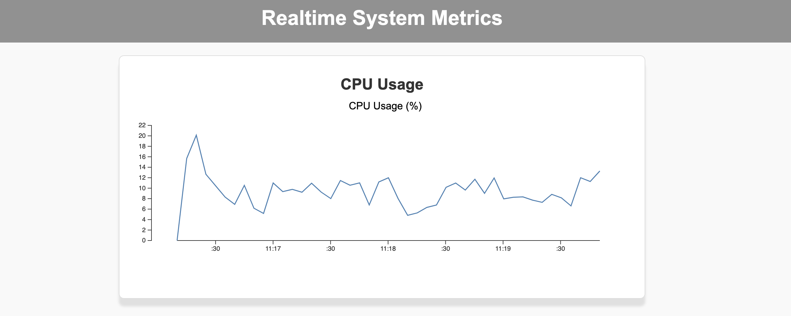
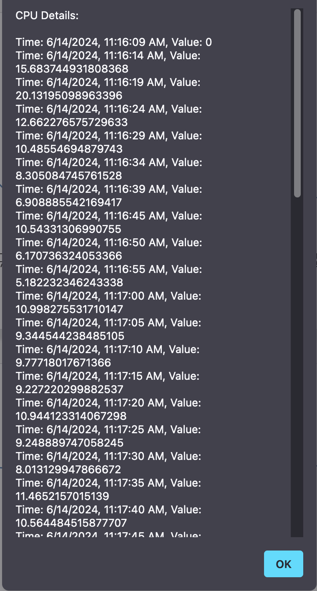

# sysmon - System Monitoring using GO and D3JS

sysmon is a system monitoring tool built using Go for the backend and D3.js for the frontend visualization. It provides real-time monitoring of various system metrics such as CPU usage, memory usage, disk usage, and network usage. Additionally, it includes endpoints for detailed system information and custom metrics.

## Features

- Real-time monitoring of CPU, memory, disk, and network usage
- RESTful API endpoints for various system metrics
- Visualization of metrics using D3.js
- Alerts for high usage thresholds
- Support for custom metrics

## Installation

1. **Clone the repository:**

    ```sh
    git clone https://github.com/yourusername/sysmon.git
    cd sysmon
    ```

2. **Install dependencies:**

    Ensure you have Go installed. Then, run:

    ```sh
    go mod tidy
    ```

3. **Run the application:**

    ```sh
    go run cmd/sysmon/main.go
    ```

4. **View the application:**

    Open your web browser and navigate to `http://localhost:8080`.

## Project Structure

```plaintext
sysmon/
├── cmd/
│   └── sysmon/
│       └── main.go
├── configs/
│   └── config.yaml
├── internal/
│   ├── collector/
│   │   ├── cpu.go
│   │   ├── memory.go
│   │   ├── disk.go
│   │   ├── network.go
│   │   ├── processes.go
│   │   ├── services.go
│   │   ├── custom.go
│   │   └── collector.go
│   ├── alert/
│   │   └── alert.go
│   ├── config/
│   │   └── config.go
│   └── server/
│       ├── server.go
│       └── templates/
│           └── index.html
├── go.mod
└── go.sum

```

screenshots



## Endpoints

### `/system`

- **Description**: Returns system information.
- **Required Parameters**: `serverId` (ID of the server)

### `/memory`

- **Description**: Returns memory information and usage.
- **Required Parameters**: `serverId` (ID of the server)

### `/swap`

- **Description**: Returns swap information and usage.
- **Required Parameters**: `serverId` (ID of the server)

### `/disks`

- **Description**: Returns disk information and usage per disk.
- **Required Parameters**: `serverId` (ID of the server)

### `/network`

- **Description**: Returns network information and usage per interface.
- **Required Parameters**: `serverId` (ID of the server)

### `/processes`

- **Description**: Returns a list of processes using the most CPU/RAM.
- **Required Parameters**: `serverId` (ID of the server)

### `/processor-usage-historical`

- **Description**: Returns CPU load average.
- **Required Parameters**: `serverId` (ID of the server)

### `/memory-historical`

- **Description**: Returns memory usage over time.
- **Required Parameters**: `serverId` (ID of the server)

### `/services`

- **Description**: Returns a list of services enabled for monitoring.
- **Required Parameters**: `serverId` (ID of the server)

### `/custom-metric-names`

- **Description**: Returns names of custom metrics.
- **Required Parameters**: `serverId` (ID of the server)

### `/custom`

- **Description**: Returns custom metric values.
- **Required Parameters**: `serverId` (ID of the server), `custom-metric` (name of the custom metric)

## Required GET Parameters

All endpoints require the following GET parameter:

- `serverId`: The ID of the server for which the information is requested.

## Custom Metrics

You can define and collect custom metrics specific to your application. Implement the collection logic in `internal/collector/custom.go` and register them using the provided functions.

## Alerting

The alerting module checks the metrics against predefined thresholds specified in the `config.yaml` file. If any metric exceeds the threshold, an alert is triggered.
